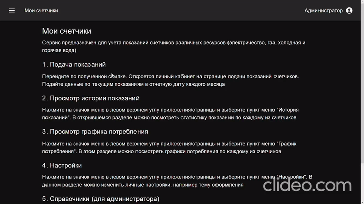
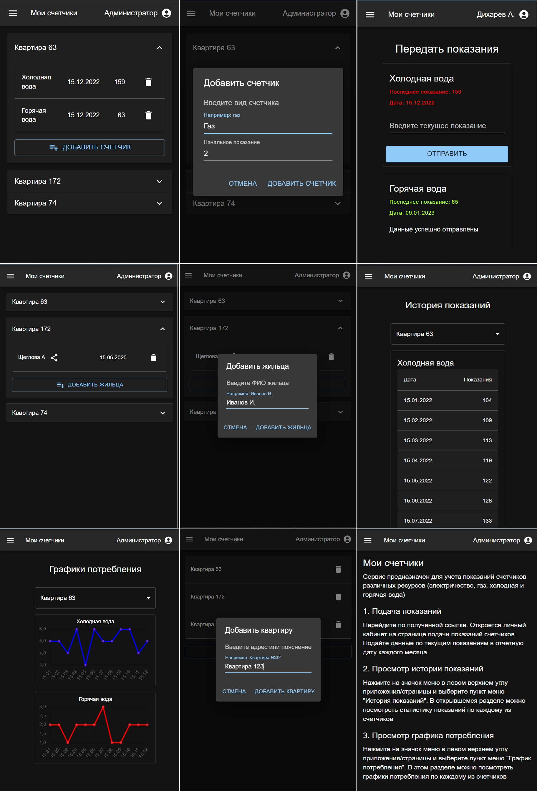

# Мои счетчики

Frontend сервиса "Мои счетчики". Используется React/MobX/Material UI/Chart.js.
В качестве backend используется Firebase REST API и Realtime Database.
Сервис предназначен для сбора показания счетчиков учета ресурсов (холодная/горячая вода,
электричество, газ и т.п.)

Реализованы:
- ведение администратором справочника квартир
- ведение администратором справочника жильцов с привязкой к квартире
- ведение администратором справочника счетчиков с привязкой к квартире
- сбор показаний счетчиков с жильцов
- история показаний
- графики потребления
- прием обращений жильцов, ответы на обращения
- вход пользователей (жильцов) по секретной ссылке с фоновой авторизацией
- PWA приложение

